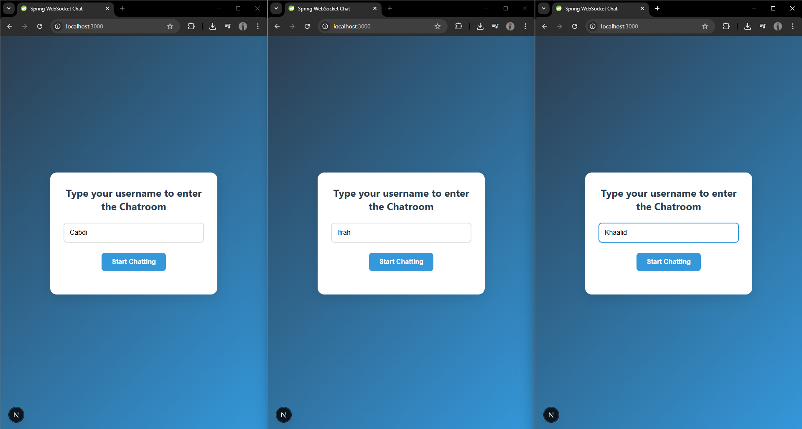
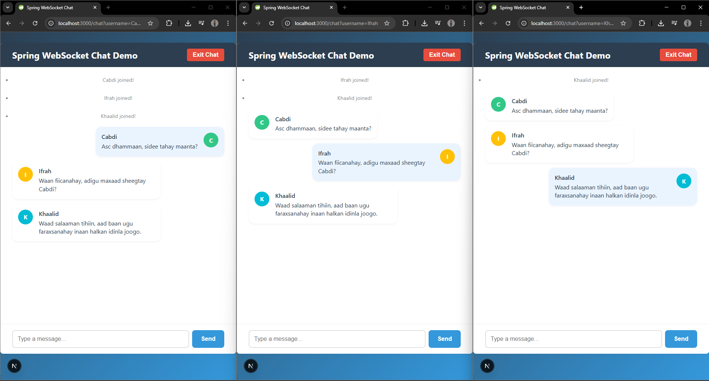

# 💬 Chat App – Spring Boot + Next.js

A real-time chat application built with **Spring Boot** for the backend and **Next.js** for the frontend. Messages are exchanged over WebSockets using the STOMP protocol with SockJS fallback support.

---

## 📷 Screenshots

### 🧍 Username Entry


### 💬 Chatroom Interface



---

## 🚀 Features

- ✅ Real-time messaging using **WebSockets (STOMP over SockJS)**
- ✅ Join/Leave notifications
- ✅ Colored avatars for users
- ✅ Auto-scroll to newest message
- ✅ Responsive layout (works on mobile)
- ✅ Clean and minimal UI

---

## 🛠️ Tech Stack

### 🧩 Frontend
- [Next.js](https://nextjs.org/) (React Framework)
- [@stomp/stompjs](https://www.npmjs.com/package/@stomp/stompjs)
- [sockjs-client](https://www.npmjs.com/package/sockjs-client)

### 🧩 Backend
- [Spring Boot](https://spring.io/projects/spring-boot)
- STOMP WebSocket messaging
- SockJS fallback
- SimpMessagingTemplate for broadcasting

---

## 📁 Project Structure

```

chat-app/
├── backend/            # Spring Boot app
│   └── src/
│       └── main/java/com/example/chat\_demo/
│           ├── config/            # WebSocketConfig and EventListener
│           ├── chat/              # Controller and message models
│           └── ChatDemoApplication.java
├── frontend/           # Next.js app
│   └── pages/
│       ├── index.tsx              # Username entry page
│       └── chat.tsx               # Chat interface
├── screenshots/        # (Optional) Screenshots for README
└── README.md

````

---

## ⚙️ Getting Started

### 📦 Backend (Spring Boot)

1. Navigate to the backend:
   ```bash
   cd backend


2. Run the app with Maven:

   ```bash
   ./mvnw spring-boot:run
   ```

> Runs on `http://localhost:8080`

---

### 💻 Frontend (Next.js)

1. Navigate to the frontend:

   ```bash
   cd frontend
   ```

2. Install dependencies:

   ```bash
   npm install
   ```

3. Start the development server:

   ```bash
   npm run dev
   ```

> Runs on `http://localhost:3000`

---

## 🌐 How It Works

* Users input their name on the home screen.
* The frontend connects to the WebSocket endpoint (`/ws`) via SockJS.
* The client subscribes to `/topic/public` for broadcast messages.
* STOMP messages are sent to:

  * `/app/chat.sendMessage` — for sending chat messages
  * `/app/chat.addUser` — when a user joins
* Spring Boot handles broadcasting messages to all subscribers.

---

## 📌 Notes

* CORS is enabled in Spring Boot for `http://localhost:3000`.
* Messages are passed as JSON payloads using a shared `ChatMessage` model.
* Session tracking is done via STOMP headers (for demo purposes).

---

## 🔐 Security Considerations

* ❗ Currently, usernames are passed via query strings — not secure.
* 🔒 For production:

  * Implement authentication (JWT, OAuth, etc.)
  * Sanitize and validate user input
  * Secure WebSocket endpoints with authentication/authorization

---

## 📈 Future Improvements

* 🔐 User authentication (e.g. JWT tokens)
* 💾 Persistent message history (e.g. PostgreSQL, MongoDB)
* 🗂️ Support for multiple chat rooms
* 📱 Mobile-first responsive styling
* 👀 Typing indicators and user presence

---


Feel free to contribute, report issues, or suggest enhancements!

---

## 📄 License

MIT License – [LICENSE](./LICENSE)
